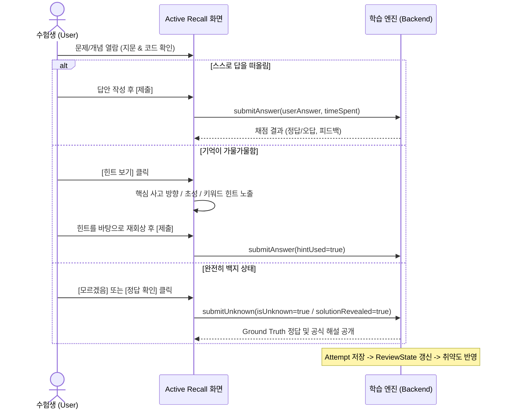

# Phase 5: 실제 학습 데이터 전략 검토 및 학습 엔진 설계서
`docs/PHASE_5_LEARNING_ENGINE_DESIGN.md`

## 1. 개요 및 설계 철학

본 문서는 **정처기 실기 PC 집중학습 플랫폼(`jungcheogi-trainer-pc`) Phase 5**의 핵심 아키텍처와 데이터 전략을 정의합니다.

### 1.1 핵심 전제: "기출문제집 단순 복제 앱" 탈피
* 본 플랫폼은 수험생이 단순히 기출문제를 반복해서 눈으로 읽고 기계적으로 정답을 암기하는 앱이 아닙니다.
* 정보처리기사 실기 시험의 특성상 기출문제는 다음과 같은 역할을 수행해야 합니다:
  1. **실제 출제 유형 및 표현 방식 파악**: 국가기술자격 실기 특유의 단답형, 빈칸 괄호 채우기, 코드 출력형 구조 파악.
  2. **핵심 출제 개념(Concept)의 기준점(Anchor)**: 기출이 다룬 핵심 지식(예: C 포인터, 디자인 패턴, 트랜잭션 ACID, SQL JOIN)을 도출.
  3. **변형(Variation) 및 능동 회상(Active Recall)의 원천**: 단순 암기를 방지하기 위해 파라미터 변형, 반대 개념 질문, 빈칸 타겟팅 문항 생성의 기준.
* **금지 사항**:
  - 사용자에게 기출문제집을 카메라로 한 장씩 찍어 업로드하도록 강제하는 OCR 종속 UX 금지.
  - 문제 수를 무조건 늘리는 단순 문제은행 양산 금지.
  - 검증되지 않은 AI 생성물을 `REAL_EXAM`(실제 기출)으로 둔갑시키는 행위 엄격 차단.

---

## 2. 기존 Phase 1~4 코드베이스 분석 및 5가지 핵심 질문에 대한 해답

### Q1. 하나의 문제에 여러 번의 풀이 기록이 어떻게 연결되는가?
* **현재 구조**:
  - `attempts` 테이블은 `question_id` (N:1 외래키)와 `session_id`를 가집니다.
  - 사용자가 문제를 풀 때마다 새로운 `attempt` 레코드가 생성되어 `answered_at` 타임스탬프와 함께 누적 저장됩니다.
* **Phase 5 개선**:
  - 한 문제에 누적된 복수 개의 Attempt 이력을 집계하여 해당 문제의 숙련도 추이(최근 3회 연속 정답 여부, 오답 빈도, 모르겠음 선택 횟수)를 산출합니다.

### Q2. AI_VARIATION 문제와 부모 기출 문제의 학습 기록을 어떻게 구분할 것인가?
* **현재 구조**:
  - `questions` 테이블은 `parent_question_id`로 기출(Parent)과 변형(Child) 간 1:N 계보를 가집니다.
  - 변형 문제는 고유한 `id`(예: `q_var_c_2d_01`)를 가지며 `source_type = 'AI_VARIATION'`으로 명확히 구분됩니다.
* **Phase 5 개선**:
  - 사용자가 변형 문제를 풀면 Attempt는 해당 변형 문제 ID로 기록되어 독립성을 유지합니다.
  - 상위 통계 분석 시에는 `parent_question_id`를 추적하여 **"원본 기출을 틀린 후 변형 문제를 통해 약점을 보완했는가?"**를 입증하는 계보형 학습 지표를 제공합니다.

### Q3. 같은 개념을 여러 문제에서 틀렸을 때 이를 어떻게 하나의 취약 개념으로 묶을 것인가?
* **현재 문제점**:
  - 기존에는 `category`와 `keywords` 문자열만 존재하여, "C 포인터"와 "배열과 포인터"가 서로 다른 문자열일 경우 하나의 취약 개념으로 정밀하게 묶이지 않았습니다.
* **Phase 5 해결책**:
  - 정규화된 `concepts` 테이블(`id`, `subject`, `category`, `title`, `description`, `key_points_json`)을 신설합니다.
  - 각 문제(`questions`)에 `concept_id` 외래키를 연결합니다.
  - 사용자가 서로 다른 3문제를 틀렸더라도 모두 `concept_id = 'c_pointer'`라면, **"C 포인터 개념 취약도(Weakness Score) 상승"**으로 집계됩니다.

### Q4. `isUnknown`, `hintUsed`, `solutionRevealed`, `score`, `timeSpentMs`의 행동 추적 활용
* **행동 지표의 의미**:
  1. `isUnknown = true` (회상 완전 실패): 오답보다 더 심각한 무지 상태. 복습 주기를 1일로 리셋하고 복습 우선순위 최상위 배치.
  2. `solutionRevealed = true` (정답 확인): 스스로 답을 떠올리지 못해 포기한 상태. 이후 입력한 정답은 순수 정답률 집계에서 분리.
  3. `hintUsed = true` (힌트 열람): 부분 회상 상태. 정답을 맞혔더라도 "보조 회상"으로 분류하여 복습 대상에 잔류.
  4. `score` (0.0 ~ 1.0): 부분 점수. 복수 키워드 중 일부만 회상한 경우 반영.
  5. `timeSpentMs`: 60초 이상의 장시간 고민 후 정답은 "망설임 정답"으로 분류하여 조기 재복습 유도.

### Q5. 현재 `review_states`가 실제 복습 엔진으로 확장하기에 충분한가?
* **기존 한계**:
  - 테이블 스키마만 존재하고 Repository 및 Attempt 연동 로직이 없었습니다.
  - Leitner Box 및 복습 상태(`NEW`, `LEARNING`, `REVIEW`, `MASTERED`)와 누적 카운터(`correct_count`, `wrong_count`, `unknown_count`, `hint_count`)가 부족했습니다.
* **Phase 5 완성**:
  - `ReviewRepository` 구축 및 `attempts` 생성 시 실시간 트리거/연동.
  - 망각 곡선에 대한 과도한 이론적 수학 시뮬레이션을 지양하고, **실제 행동(오답, 모르겠음, 힌트 사용, 정답 확인)에 기반한 안정적인 복습 우선순위 큐**를 구현합니다.

---

## 3. 학습 데이터 계층 및 신뢰도 분리 체계

```text
[ 데이터 출처 및 신뢰도 계층 ]

REAL_EXAM (신뢰도 100% - 공식 기출)
  ├── 출제 연도, 회차, 문항 번호 엄격 보존
  ├── 검증된 기준 정답 (Ground Truth) 및 공식 해설
  └── 절대 AI 생성 결과로 덮어쓰지 않음
        │
        ├── 출제 개념 연결 (concept_id)
        │      │
        │      ├── AI_VARIATION (변형 문항)
        │      │      ├── 난이도 상승/하락 변형
        │      │      ├── 파라미터/코드 구조 변형
        │      │      └── REAL_EXAM으로 승격 금지
        │      │
        │      └── ACTIVE_RECALL (능동 회상 문항)
        │             ├── 빈칸 회상 (BLANK)
        │             ├── 핵심 키워드 회상 (KEYWORD)
        │             ├── 실행 순서 회상 (ORDER)
        │             └── 개념 요약 회상 (EXPLANATION)
        │
TEXTBOOK / LECTURE_NOTE (신뢰도 90% - 수험서/교재)
  └── 공인 교재 출처의 개념 확인용 문제 및 보충 설명

TEST_FIXTURE (신뢰도 0% - 개발/테스트용)
  └── 실 수험생의 학습 통계 및 복습 대상에서 엄격 분리/필터링 가능
```

---

## 4. Active Recall(능동 회상) 학습 UX 흐름

단순 텍스트 열람과 앱 기반 학습의 본질적 차이는 **"기억에서 직접 꺼내는 노력(Effortful Retrieval)"**에 있습니다.



---

## 5. 코드 라인별 해부(Line-by-Line Code Anatomy) 모델

* 기출문제의 C/Java/Python 코드는 단순하지 않고 여러 문법이 복합되어 있습니다.
* 전체 코드를 한꺼번에 설명하면 흐름을 놓치고, 너무 잘게 쪼개면 맥락을 잃습니다.
* **라인별 설명 데이터 구조 (`codeLineExplanations`)**:
  - 각 코드 줄 번호(`line`)를 키로 하여, 해당 라인의 의미(`explanation`)와 핵심 토큰(`tokens`: 변수, 연산자, 포인터 역참조의 동작)을 구조화합니다.
  - UI에서는 코드 뷰어의 특정 줄을 클릭하면 아코디언 형태로 해부 설명이 펼쳐집니다.

---

## 6. DB 마이그레이션 계획 (`005_learning_engine.sql`)

1. **`concepts` 테이블 신설**:
   - `id TEXT PRIMARY KEY`, `subject TEXT`, `category TEXT`, `title TEXT`, `description TEXT`, `key_points_json TEXT`, `importance INTEGER`.
2. **`questions` 테이블 확장**:
   - `concept_id TEXT REFERENCES concepts(id) ON DELETE SET NULL`.
   - `hints_json TEXT DEFAULT '[]'`.
   - `code_line_explanations_json TEXT`.
   - `active_recall_meta_json TEXT`.
3. **`review_states` 테이블 고도화**:
   - `correct_count INTEGER DEFAULT 0`.
   - `wrong_count INTEGER DEFAULT 0`.
   - `unknown_count INTEGER DEFAULT 0`.
   - `hint_count INTEGER DEFAULT 0`.
   - `last_score REAL DEFAULT 0`.
   - `review_state TEXT DEFAULT 'NEW'`.
   - `weakness_score REAL DEFAULT 0`.

---

## 7. 구현 로드맵
1. `shared` 패키지 타입 정의 (`concept.ts`, `review.ts`, `question.ts`).
2. `005_learning_engine.sql` 마이그레이션 작성 및 실행.
3. `ConceptRepository`, `ReviewRepository` 구현.
4. `SessionRepository` & `sessions.ts` submit 핸들러에서 ReviewState 자동 갱신 연동.
5. `/api/learning/weak-concepts`, `/api/learning/reviews/due` 등 학습 API 구축.
6. 클라이언트 대시보드에 취약영역 및 복습 큐 위젯, Active Recall UI 추가.
7. 자동화 테스트(시나리오 A~H) 100% 통과 검증.
