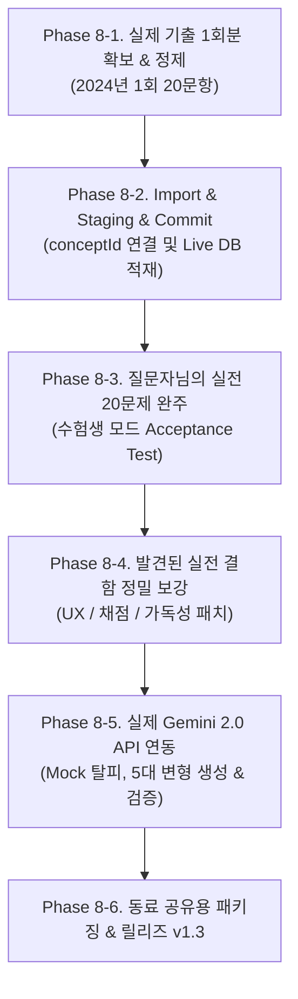

# [Master Specification & Handover Document] 정처기 실기 PC 집중학습 플랫폼
> **문서 버전**: 2.0 (초정밀 전수 인수인계 명세서)  
> **기준 커밋**: `29aca11` (`feat(phase7): establish learning data and AI variation pipeline`)  
> **기준 릴리즈 태그**: `v1.2` (이전 태그: `v1.0`, `v1.1` 완전 보존)  
> **기준 브랜치**: `master`  
> **작성 목적**: 다른 AI 에이전트나 엔지니어가 코드베이스를 처음 열어보더라도, 지난 7개 Phase 동안 구현된 아키텍처, 알고리즘, DB 스키마, 잠재적 리스크 및 **"인간 실사용 테스트(Human Dogfooding) 부재"에 따른 미검증 영역**을 100% 투명하게 파악하고 무결하게 이어받기 위한 전수 명세서.

---

## 1. 프로젝트 정체성 및 3대 핵심 목표

### 1.1 본 프로젝트의 정체성 (무엇이 아니고, 무엇인가?)
* **단순 문제은행 복제 앱이 아닙니다**: 단순한 기출문제 텍스트 나열이나 무작위 문제 풀이 앱이 아닙니다.
* **책 사진 OCR에 의존하는 임시방편이 아닙니다**: 매번 수험서 사진을 찍어 AI 채팅창에 올려서 발생하는 빛 반사, 촬영 피로도, 이전 오답 기록 단절을 원천 해결하기 위한 독립 PC 플랫폼입니다.
* **본 플랫폼의 정의**: **"능동적 회상(Active Recall) + 행동 기반 스마트 채점 + Leitner 5-Box 간격 복습 + 출제 개념(Concept) 추적 + AI 변형 문제 4계층 검증/Staging 격리 파이프라인"**을 갖춘 집중 학습 환경입니다.

### 1.2 사용자의 3대 핵심 목표 (개발 판단의 기준점)
1. **수험생 본인의 합격**: 실제 정보처리기사 실기 시험에 합격할 수 있도록 실전 기출과 취약 개념을 집중 훈련.
2. **동료/스터디원 공유 가능한 완성도**: 나 혼자 대충 돌아가게 만든 스크립트가 아니라, 회사 동료나 스터디원에게 배포했을 때 "왜 이 답이 정답/오답인지", "AI가 만든 문제가 왜 믿을 수 있는지" 완벽히 설명 가능한 신뢰도.
3. **독자 설계·구현한 개발자 포트폴리오**: 외부 프레임워크나 튜토리얼을 베낀 것이 아니라, 엔터프라이즈급 데이터 파이프라인(Staging, Validation, Human Review, Telemetry)을 연휴 기간 동안 오롯이 완결하여 기술적 역량을 인정받는 성과물.

---

## 2. Phase 1 ~ 7 전수 구현 연혁 및 달성 현황

| Phase | Git Release | 핵심 구현 내용 | 검증 테스트 스위트 |
| :---: | :---: | :--- | :--- |
| **Phase 1** | Foundation | • npm workspaces 모노레포 구축 (`shared`, `server`, `client`)<br>• Fastify + better-sqlite3 + React 18 + Vite 기반 설정<br>• 초기 헬스체크 및 DB 연결 | `health.test.ts` |
| **Phase 2** | Domain Foundation | • 문제 도메인 엔티티 확립 (`Question`, `Subject`, `QuestionType`)<br>• Ground Truth(기준 정답)와 AI 해설의 엄격한 스키마 분리<br>• `QuestionRepository` CRUD 및 과목/출처 필터링 | `questions.test.ts` |
| **Phase 3** | Practice & Grading | • `StudySession` 라이프사이클 (ACTIVE, COMPLETED)<br>• `smartGrader.ts` 구현 (동의어, 공백, 영문 대소문자, 조사 제거 등)<br>• `attempts` 테이블 구축 및 풀이 이력 Append-only 저장 | `sessions.test.ts`<br>`grading_edge_cases.test.ts` |
| **Phase 4** | Import Pipeline | • Markdown 및 JSON 기출/교재 파서 구축<br>• `import_batches` 및 `staged_questions` Staging 스키마 도입<br>• 지문 정규화 기반 중복 탐지 (`fingerprint.ts`)<br>• 인간 검수(Review) 및 승인(Commit) 트랜잭션 | `imports.test.ts` |
| **Phase 5** | Learning Engine | • 정규화된 출제 개념 테이블 `concepts` 신설<br>• `review_states` 테이블 고도화 (Leitner Box 1~5, 주기 1~30일)<br>• 행동 지표(`isUnknown`, `hintUsed`, `solutionRevealed`, `score`) 수집<br>• 코드 라인별 해부(`codeLineExplanations`) 데이터 모델 구축 | `learning_engine.test.ts` |
| **Phase 6** | Recommendation | • `RecommendationEngine` 구축 (8대 가중치 기반 다차원 점수화)<br>• "오늘의 학습 큐" (`daily-queue`) 및 50/30/20 자동 세션 빌더<br>• 취약 개념 집중 드릴 (`createConceptDrillSession`)<br>• 동일 부모 문항 과다 중복 억제 (다양성 필터링) | `recommendation_engine.test.ts` |
| **Phase 7** | Data Pipeline & AI Validation | • 기출문제 Natural Key (`examYear` + `examRound` + `questionNumber`) 중복 방어<br>• `conceptId`의 파서→Staging→Live Question 영속 파이프라인 완성<br>• 5대 Canonical 변형 타입 정의 (`recommendation.ts`)<br>• 4계층 무결성 검증기 (`variationValidator.ts`)<br>• AI 변형 문제의 Live DB 직접 삽입 원천 차단 (Staging 격리) | `data_pipeline_and_variations.test.ts` |

---

## 3. 데이터베이스 전수 스키마 및 물리 모델

모든 테이블은 SQLite (`data/trainer.db`)에 물리적으로 생성되어 있으며, 마이그레이션 파일(`server/src/db/migrations/001~006`)에 의해 관리됩니다.

### 3.1 `questions` (문항 마스터 테이블)
* **`id`** `TEXT PRIMARY KEY`: 고유 식별자 (기출: `q_2024_01_05`, Import: `q_imp_...`, 변형: `q_var_...`)
* **`source_type`** `TEXT NOT NULL`: `REAL_EXAM`, `TEXTBOOK`, `AI_VARIATION`, `TEST_FIXTURE`, `USER_IMPORTED`
* **`exam_year`** `INTEGER`, **`exam_round`** `INTEGER`, **`question_number`** `INTEGER`: 기출 메타데이터 (Natural Key)
* **`parent_question_id`** `TEXT REFERENCES questions(id)`: AI 변형 문제의 원본 기출 추적용 외래키
* **`concept_id`** `TEXT REFERENCES concepts(id)`: 출제 핵심 개념 연결 외래키
* **`subject`** `TEXT NOT NULL`: 5대 과목 (`소프트웨어설계`, `데이터베이스구축`, `프로그래밍언어활용`, `정보시스템구축관리`, `신기술/보안`)
* **`category`** `TEXT NOT NULL`, **`sub_category`** `TEXT`: 단원 및 세부 토픽
* **`type`** `TEXT NOT NULL`: `SHORT_ANSWER`, `CODE_TRACE`, `SQL`, `ACTIVE_RECALL`, `MULTIPLE_CHOICE`
* **`question_text`** `TEXT NOT NULL`: 문제 본문 지문
* **`code_snippet`** `TEXT`, **`language`** `TEXT`: 소스코드 및 언어 (`C`, `JAVA`, `PYTHON`, `SQL`)
* **`options_json`** `TEXT`: 객관식 보기 JSON 배열
* **`ground_truth_answer`** `TEXT NOT NULL`: 검증된 정답 JSON (단일 문자열 또는 복수 정답 배열)
* **`official_explanation`** `TEXT`: 공식 기출 해설 (Ground Truth)
* **`ai_explanation`** `TEXT`: AI 생성 해설 (공식 해설과 철저히 격리)
* **`ai_variation_notes`** `TEXT`: 변형 의도 및 변경점 메모
* **`hints_json`** `TEXT`: 단계별 힌트 JSON 배열 (Active Recall용)
* **`code_line_explanations_json`** `TEXT`: 코드 라인별 해부 설명 JSON 객체
* **`active_recall_meta_json`** `TEXT`: 능동 회상 메타데이터
* **`difficulty`** `TEXT NOT NULL DEFAULT 'MEDIUM'`: `EASY`, `MEDIUM`, `HARD`
* **`keywords_json`** `TEXT NOT NULL DEFAULT '[]'`: 핵심 키워드 목록
* **`structural_fingerprint`** `TEXT`: 중복 탐지용 정규화 해시

### 3.2 `concepts` (출제 핵심 개념 테이블)
* **`id`** `TEXT PRIMARY KEY`: `concept_c_pointer`, `concept_gof_builder`, `concept_db_acid` 등
* **`subject`** `TEXT NOT NULL`, **`category`** `TEXT NOT NULL`
* **`title`** `TEXT NOT NULL`: 개념 표제어
* **`definition`** `TEXT NOT NULL`: 학술적/표준 정의
* **`core_analogy`** `TEXT`: 직관적 이해를 돕는 비유 (예: "포인터 = 아파트 동호수 쪽지")
* **`key_facts_json`** `TEXT NOT NULL DEFAULT '[]'`: 시험에 반드시 나오는 3~5대 핵심 팩트
* **`importance`** `INTEGER NOT NULL DEFAULT 2`: 중요도 (1~3)
* **`mnemonic_json`** `TEXT`: 암기 꿀팁(두문자어, 캐치프레이즈)
* **`related_keywords_json`** `TEXT NOT NULL DEFAULT '[]'`: 연관 검색어

### 3.3 `attempts` (풀이 시도 로그 테이블 - Append Only)
* **`id`** `TEXT PRIMARY KEY`: `att_...`
* **`question_id`** `TEXT NOT NULL REFERENCES questions(id)`
* **`session_id`** `TEXT REFERENCES sessions(id)`
* **`user_answer`** `TEXT NOT NULL`: 사용자가 입력한 답안 JSON
* **`is_correct`** `INTEGER NOT NULL`: 1(정답), 0(오답)
* **`score`** `REAL DEFAULT 0`: 부분 점수 (0.0 ~ 1.0)
* **`miss_type`** `TEXT`: 오답 유형 (`CONCEPT_CONFUSION`, `TRACING_ERROR`, `CALCULATION_ERROR` 등)
* **`time_spent_ms`** `INTEGER DEFAULT 0`: 문제 풀이 소요 시간(밀리초)
* **`is_unknown`** `INTEGER DEFAULT 0`: "모르겠음" 클릭 여부 (1이면 완전 회상 실패)
* **`hint_used`** `INTEGER DEFAULT 0`: 힌트 열람 여부
* **`solution_revealed`** `INTEGER DEFAULT 0`: 답안 제출 전 "정답 확인" 클릭 여부
* **`feedback`** `TEXT`: 스마트 채점기 피드백
* **`created_at`** / **`answered_at`** `TEXT NOT NULL`: 응답 시각

### 3.4 `review_states` (Leitner 간격 복습 및 취약도 테이블)
* **`question_id`** `TEXT PRIMARY KEY REFERENCES questions(id)`
* **`concept_id`** `TEXT REFERENCES concepts(id)`
* **`box_level`** `INTEGER NOT NULL DEFAULT 1`: Leitner 상자 (1 ~ 5)
* **`interval_days`** `INTEGER NOT NULL DEFAULT 1`: 다음 복습 주기 (1, 3, 7, 14, 30일)
* **`repetitions`** `INTEGER NOT NULL DEFAULT 0`: 연속 성공 횟수
* **`lapses`** `INTEGER NOT NULL DEFAULT 0`: 강등/오답 횟수
* **`correct_count`**, **`wrong_count`**, **`unknown_count`**, **`hint_count`** `INTEGER NOT NULL DEFAULT 0`
* **`last_score`** `REAL NOT NULL DEFAULT 0`: 직전 풀이 점수
* **`weakness_score`** `REAL NOT NULL DEFAULT 0`: 문항 취약도 (0.0 ~ 1.0)
* **`review_state`** `TEXT NOT NULL DEFAULT 'NEW'`: `NEW`, `LEARNING`, `REVIEW`, `MASTERED`
* **`last_studied_at`** `TEXT`, **`next_review_at`** `TEXT NOT NULL`: 복습 스케줄 타임스탬프

### 3.5 `import_batches` & `staged_questions` (Staging 검수 격리 테이블)
* **`import_batches`**: Import 세션 단위 관리 (`status`: `PENDING_REVIEW`, `PARTIALLY_APPROVED`, `APPROVED`, `REJECTED`, `COMMITTED`)
* **`staged_questions`**:
  * 문제 필드 전체 + 검수 메타데이터 보유
  * **`duplicate_status`**: `NEW`, `DUPLICATE_WARNING`, `EXACT_MATCH`
  * **`validation_issues_json`**: 4계층 유효성 검사 결과 이슈 배열
  * **`review_status`**: `PENDING`, `APPROVED`, `REJECTED`, `COMMITTED`
  * **`committed_question_id`**: Live 승격 시 발급된 실제 question ID

---

## 4. 핵심 알고리즘 및 엔진 로직 명세

### 4.1 스마트 채점 알고리즘 (`shared/src/utils/smartGrader.ts`)
1. **정규화 파이프라인**:
   * 양 끝 공백 제거 및 연속 공백을 단일 공백으로 치환.
   * 영문 대소문자 무시 (`toLowerCase()`).
   * 특수문자/문장부호(마침표, 쉼표, 따옴표) 선택적 정규화.
   * 한글 격조사(`은/는/이/가/을/를/으로/로`) 어미 정규화.
2. **복수 동의어 판정**:
   * 기준 정답이 배열인 경우(`["빌더", "Builder"]`), 요소 중 하나라도 일치하면 정답 인정.
3. **숫자/코드 결과 판정**:
   * 정수/실수 공백 및 부호 비교.
   * SQL 문장의 경우 세미콜론(`;`) 누락 허용 및 키워드 대소문자 무시.
4. **오답 행동 분리**:
   * 사용자가 `isUnknown = true`로 제출 시: 무조건 오답 판정, `score = 0.0`.
   * 사용자가 `solutionRevealed = true` 후 제출 시: 오답 판정 및 ReviewState 1단계 강등.

### 4.2 Leitner 5-Box 간격 복습 주기 산출 (`ReviewRepository.recordAttempt`)
```text
[ 회상 실패 판정 ]
- isUnknown === true OR solutionRevealed === true OR score < 0.5
  => boxLevel = 1 (1단계 강등)
  => lapses += 1
  => intervalDays = 1일 (즉시 리셋)
  => reviewState = 'LEARNING'

[ 힌트 의존 부분 회상 ]
- hintUsed === true AND score >= 0.8
  => boxLevel 유지 (보수적 승급 제한)
  => intervalDays = Math.round(intervalDays * 1.2)
  => reviewState = 'LEARNING'

[ 자력 완전 회상 ]
- score >= 0.8 AND !hintUsed AND !solutionRevealed
  => boxLevel = Math.min(5, boxLevel + 1)
  => repetitions += 1
  => intervalDays = { 1: 1일, 2: 3일, 3: 7일, 4: 14일, 5: 30일 }[boxLevel]
  => boxLevel === 5 ? 'MASTERED' : 'REVIEW'

[ 문항 취약도(weaknessScore) 공식 ]
totalAttempts = correct + wrong + unknown
penalty = (wrong * 1.0 + unknown * 1.3 + hint * 0.4) / totalAttempts
weaknessScore = min(1.0, max(0.0, penalty * 0.7 + (1.0 - score) * 0.3))
```

### 4.3 8-Factor 개인화 추천 점수 알고리즘 (`RecommendationEngine.scoreQuestion`)
```text
총점 = dueScore + weaknessScore + recencyScore + failureScore + 
       unknownScore + solutionRevealedScore + hintDependencyScore + 
       longInactiveScore + noveltyScore - diversityPenalty

- dueScore: nextReviewAt <= now 인 경우 기본 35점 + 연체일수 가중 (최대 70점)
- weaknessScore: 취약도(0.0~1.0) * 25점 + (상위 취약개념 소속 시 10점 추가)
- unknownScore: 최근 풀이에서 모르겠음 선택 시 24점
- solutionRevealedScore: 최근 풀이에서 정답 확인 클릭 시 20점
- failureScore: 최근 풀이 오답 시 18점
- hintDependencyScore: 힌트 열람 이력 존재 시 12점
- noveltyScore: 한 번도 풀지 않은 신규 문항 15점
- diversityPenalty: 동일 세션 내 동일 parentQuestionId 문항 2개 초과 시 -50점 감점
```

### 4.4 4-Layer AI 변형 검증기 (`VariationValidator.validate`)
1. **Layer 1: Schema**: 본문 5자 이상, 정답 비어있지 않음, `parentQuestionId` 필수, 유효한 `variationType`.
2. **Layer 2: Domain**: AI 변형 문항의 공식 해설(`officialExplanation`) 사칭 금지, `aiExplanation` 필수, 부모 문항과 `conceptId` 일관성 검증.
3. **Layer 3: Ground Truth**: 지문과 정답의 완전 일치(자명 복제) 차단, 원본 기출문제를 토씨 하나 안 바꾸고 100% 그대로 복제한 경우 경고, 객관식 정답의 보기 존재 여부 검증.
4. **Layer 4: Code Syntax**: 프로그래밍 문제의 소괄호`()`, 중괄호`{}` 짝 일치 정적 검증.

---

## 5. REST API 엔드포인트 전수 명세

모든 API는 Fastify 백엔드(`server/src/routes/`)에 마운트되어 있습니다.

### 5.1 문제 관리 (`/api/questions`)
* `GET /api/questions`: 문제 목록 조회 (쿼리: `subject`, `type`, `difficulty`, `sourceType`, `conceptId`, `parentQuestionId`, `search`, `limit`, `offset`)
* `GET /api/questions/:id`: 특정 문제 상세 조회 (해당 문제의 변형 목록 포함)
* `GET /api/questions/:id/variations`: 특정 문제의 파생 변형 문제 목록 조회

### 5.2 학습 세션 및 풀이 (`/api/sessions`)
* `POST /api/sessions`: 일반 학습 세션 생성 (`subject`, `count`, `sourceType`)
* `GET /api/sessions/:id`: 세션 상태 및 현재 진행 문제 조회
* `POST /api/sessions/:id/submit`: 답안 제출 및 스마트 채점 (Body: `questionId`, `userAnswer`, `timeSpentMs`, `isUnknown`, `hintUsed`, `solutionRevealed`) -> ReviewState 자동 갱신 반환
* `GET /api/sessions/:id/summary`: 세션 완료 결과 요약 통계 조회

### 5.3 Staging 및 Import (`/api/imports`)
* `POST /api/imports/parse`: 마크다운 또는 JSON 텍스트 파싱 후 Staging 배치 생성
* `GET /api/imports/batches`: 전체 Import 배치 목록 조회
* `GET /api/imports/batches/:id`: 특정 배치의 Staging 문항 상세 및 중복/검증 상태 조회
* `PUT /api/imports/staged/:id`: 검수 중 Staging 문항의 지문, 정답, 과목, conceptId, 검수 상태(`APPROVED`/`REJECTED`) 수정
* `POST /api/imports/batches/:id/commit`: `APPROVED`된 문항들만 선별하여 Live `questions` 테이블로 원자적 트랜잭션 Commit

### 5.4 학습 엔진 & 추천 (`/api/learning`)
* `GET /api/learning/dashboard`: 대시보드 요약 (총 학습 수, 오늘 복습 도래 수, 숙련 수, 평균 정답률)
* `GET /api/learning/weak-concepts`: Attempt 이력 기반 취약 개념 상위 목록 조회
* `GET /api/learning/concepts`: 전체 출제 개념 목록 조회 (미시딩 시 자동 6종 시딩)
* `GET /api/learning/concepts/:id`: 특정 개념 상세 및 소속 문제 목록 조회
* `GET /api/learning/reviews/due`: 오늘 복습 도래(Due) 문항 큐 조회
* `GET /api/learning/reviews/:questionId`: 특정 문항의 Leitner 상태 및 과거 풀이 이력
* `GET /api/learning/recommendations`: 8-Factor 점수화 기반 개인화 추천 문항 목록
* `GET /api/learning/daily-queue`: 오늘의 학습 큐 요약 통계 (Due, Weak, Failed, New)
* `POST /api/learning/daily-session`: 50/30/20 비율 기반 오늘의 추천 세션 원클릭 생성
* `POST /api/learning/drill`: 특정 취약 개념 집중 드릴 세션 생성 (`conceptId`, `count`)
* `POST /api/learning/variations/generate`: AI 변형 문제 생성, 4계층 검증 및 Staging 적재
* `POST /api/learning/variations/validate`: 변형 문제 유효성 검증기 독립 호출

---

## 6. ★ 핵심 위험 분석: "휴먼 실전 테스트(Dogfooding) 부재"에 따른 잠재 결함

> **주의**: 이 프로젝트는 Phase 1부터 Phase 7까지 8개 단위/통합 테스트 스위트를 100% 통과(Pass)했습니다.  
> **그러나, 실제 수험생이 키보드로 20문제를 끝까지 풀며 UI와 채점을 검증하는 '휴먼 테스트'는 아직 단 한 번도 수행되지 않았습니다.**  
> 다음은 실제 사용 시 터져 나올 수 있는 잠재적 결함 및 미검증 영역 목록입니다.

### 6.1 프론트엔드 입력 및 UX 결함 가능성
1. **한글 IME 조합 문자 중복 입력 버그**:
   * React 제어 컴포넌트(`value`, `onChange`)에서 한글 입력 후 Enter를 누를 때, 마지막 글자가 두 번 찍히거나 엔터 이벤트가 2회 발화되는 React 특유의 IME 버그 미검증.
2. **다중 괄호(빈칸 2~3개) 단답형 입력 처리**:
   * 현재 `userInputs`는 단일 문자열 위주로 처리됨. 지문에 `①`, `②`, `③` 괄호가 여러 개 있는 기출문제에서 사용자가 답안을 `A, B, C`로 썼을 때 입력 UI가 이를 직관적으로 지원하는지 미검증.
3. **코드 스니펫 가독성 및 스크롤**:
   * 30줄 이상의 긴 C언어 포인터 코드나 다중 클래스 Java 코드가 모달 창 안에서 가로 스크롤/세로 스크롤 시 지문과 어떻게 어우러지는지 실전 검증 필요.
4. **키보드 단축키 부재**:
   * 마우스 클릭 없이 `Ctrl + Enter`(제출), `Tab`(다음 필드 이동), `Esc`(힌트 닫기) 등의 수험생 집중용 단축키 미구현.

### 6.2 스마트 채점 판정의 억울한 오답(False Negative) 리스크
1. **영문/한글 약어 복수 표기**:
   * 예: 사용자가 `SQL 인젝션`이라고 썼는데 정답지에 `SQL Injection`만 등록되어 있는 경우 채점기가 오답 처리할 위험.
2. **SQL 문장의 세미콜론 및 띄어쓰기**:
   * `SELECT * FROM student WHERE grade >= 3;` 문장에서 세미콜론 유무나 연산자 공백 차이로 인한 오답 판정 위험.
3. **주관식 서술형/약술형 한계**:
   * 키워드가 포함되었으나 어순이 다른 경우의 부분 점수 처리 실전 데이터 부족.

### 6.3 데이터 라이프사이클 및 화면 갱신 결함 가능성
1. **Live DB 커밋 후 화면 미반영**:
   * `ImportModal`에서 문제를 커밋한 직후, 메인 화면의 Question Browser나 세션 생성 드롭다운에 즉시 반영되지 않고 F5(새로고침)를 해야만 보이는 상태 동기화 이슈 가능성.
2. **Cold Start 상태에서의 추천 큐**:
   * 풀이 이력(Attempt)이 0건일 때 `isColdStart = true` 플래그는 반환되지만, UI에서 사용자에게 "문제를 먼저 풀어보세요"라는 안내가 충분히 친절한지 미검증.

---

## 7. Phase 8 실전 실행 마스터 플랜 (Action Plan)

Phase 8은 새로운 코드를 마구 추가하는 단계가 아닙니다.  
**"실제 기출 20문항을 넣고, 질문자님이 직접 시험 보듯 완주하여 위의 잠재 결함들을 잡아내는 단계"**입니다.



### 세부 작업 항목
1. **Phase 8-1: 기출 1회분 데이터 정제**:
   * 수제비 등 보유 수험서의 2024년 1회 실기 20문제를 Gemini Pro의 비전/OCR을 활용해 표준 Markdown 규격으로 10분 만에 정제.
2. **Phase 8-2: 파이프라인 실전 검증**:
   * `ImportModal`에 넣고 Natural Key 중복 체크, 4계층 Validation 확인 후 Live DB에 Commit.
3. **Phase 8-3: 실전 모의고사 완주 (Dogfooding)**:
   * 질문자님이 직접 20문제를 처음부터 끝까지 풀며, "채점이 억울한가?", "코드 읽기 불편한가?", "입력이 답답한가?"를 메모.
4. **Phase 8-4: 실전 결손 정밀 보강 (Phase 8-A Fix)**:
   * 메모된 진짜 수험생 마찰 요소를 정밀 타격하여 수정.
5. **Phase 8-5: 진짜 Gemini API 연동 (Mock 탈피)**:
   * `variationGenerator.ts`에 `GoogleGenAI` SDK를 붙여, 실제 고품질 AI 변형 문제가 생성되어 Staging으로 들어오도록 완성.
6. **Phase 8-6: 최종 검수 및 Git Release `v1.3`**:
   * 전 테스트 통과 확인 후 `v1.3` 태그 확정 및 푸시.

---

## 8. 절대 준수할 원칙 (인수인계 엔지니어 필독)

1. **검수 완료 전 Commit / Tag / Push 금지**: 모든 변경 사항은 단위 테스트 및 프로덕션 빌드 통과 후 확정할 것.
2. **기존 Release Tag 보호**: `v1.0`, `v1.1`, `v1.2` 태그를 임의로 삭제하거나 Git 히스토리를 Rebase/Force Push 하지 말 것.
3. **`package.json` 버전 수정 금지**: `package.json`의 버전은 모노레포 전체에서 `"0.1.0"`으로 고정하며, 릴리즈는 오직 Git Tag로만 관리함.
4. **Ground Truth 오염 금지**: `REAL_EXAM`의 공식 해설을 AI 텍스트로 덮어쓰지 말 것.
5. **AI 변형 Live DB 직접 삽입 금지**: AI 생성물은 반드시 `staged_questions` 테이블의 `PENDING` 상태를 거쳐야 함.
